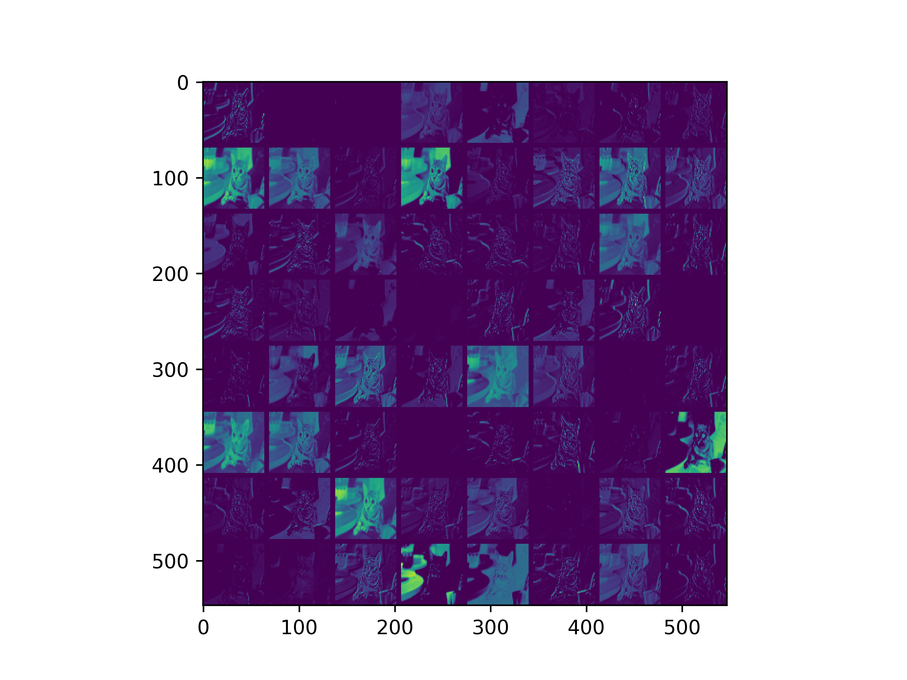
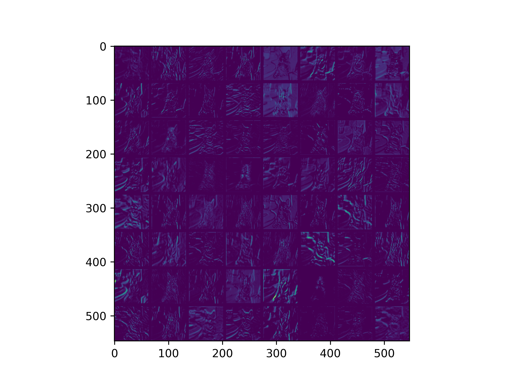
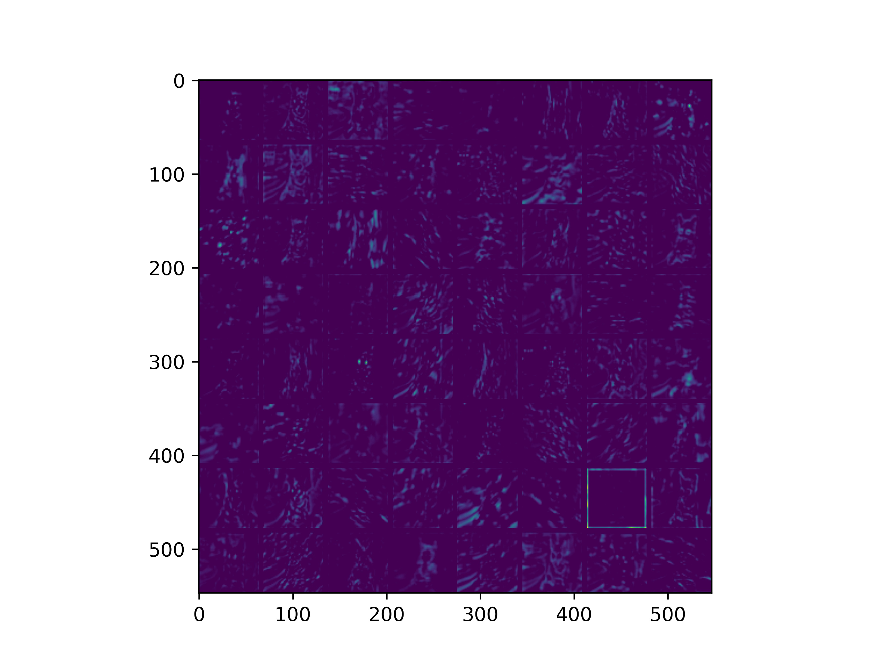
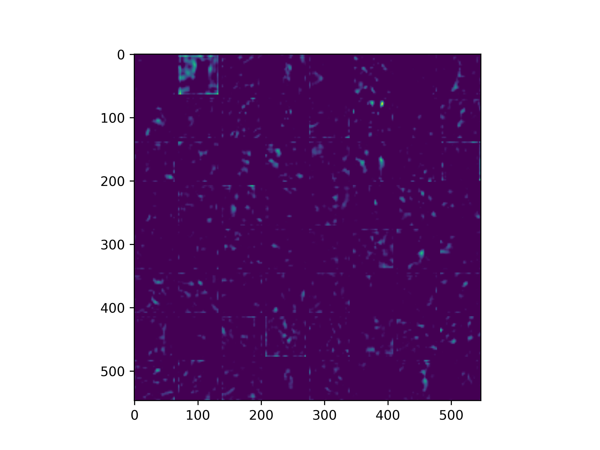
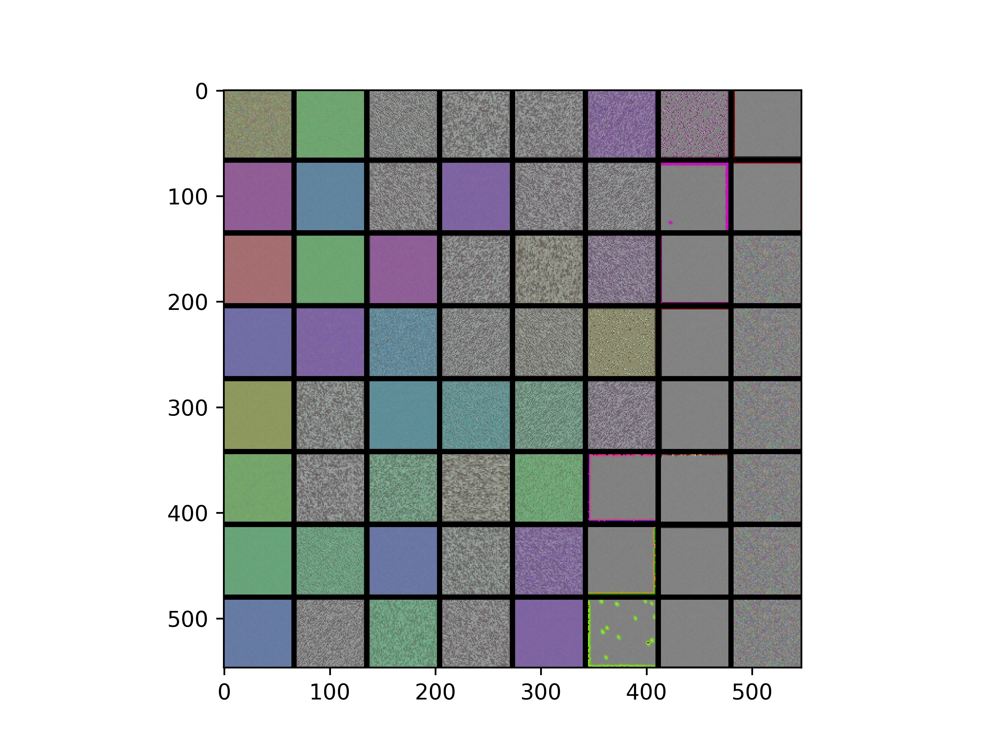
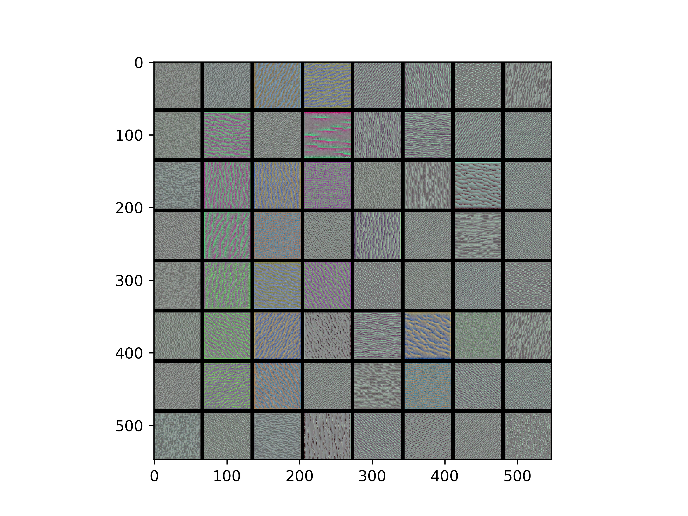
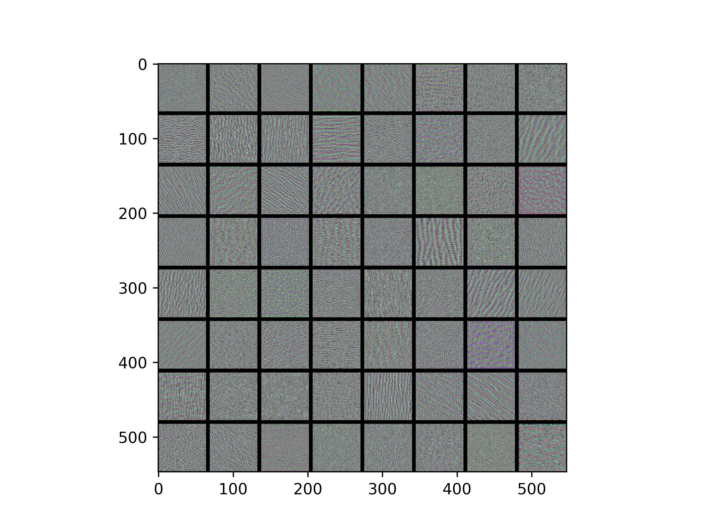
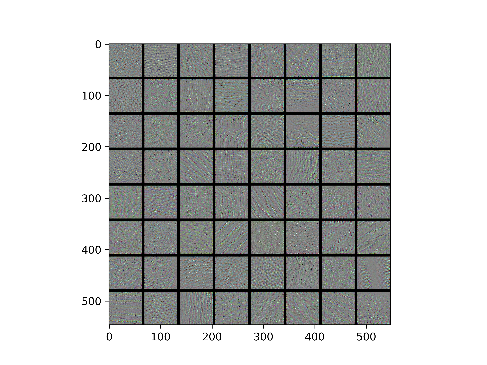
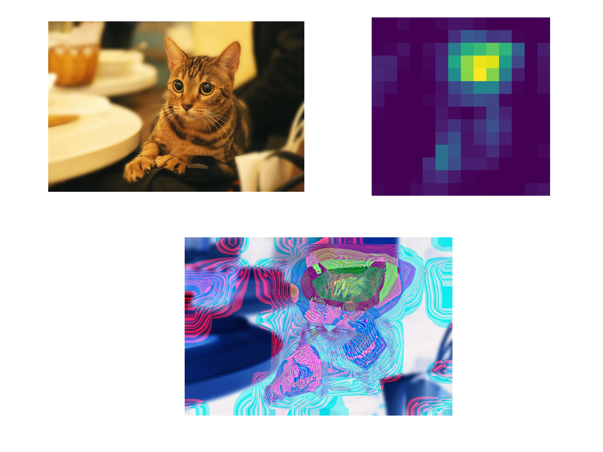

# VisualizationCNN
Visualization CNN model by Keras.

## Requirement
- Python 3.6 
- Keras 2.2.2
- Tensorflow-gpu 1.8.0  
- OpenCV 3.4

## Support model
- VGG16
- VGG19
- ResNet50
- InceptionV3
- Xception
- MobileNet
- DenseNet121

## Visualization (VGG16 example)
**Visualizing intermediate conv outputs**

**Visualizing conv filters**

**Visualizing heatmaps of class activation in an image**

